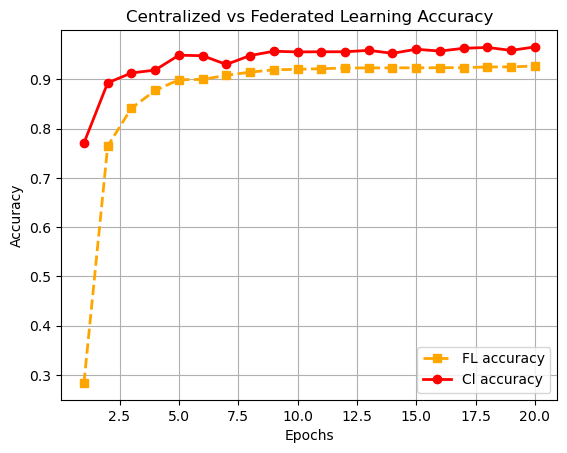

# Abnormal Driving FL

This repository contains implementations of both centralized and federated learning on an abnormal driving behavior dataset. The goal is to compare the performance of these two learning approaches and explore the potential advantages and challenges of using federated learning for this task.

## Directory Structure

The repository is organized into the following main directories:

1. `cent_training`: This directory contains scripts for centralized learning using the ResNet architecture. The centralized learning approach involves training the model on a single central server with access to the entire dataset.

2. `fed_learning`: This directory contains scripts for federated learning, which involves distributed training across multiple clients while keeping the data on each client private. The directory includes the necessary components such as client, dataloader, and server implementations for federated learning.

3. `data`: In this directory, you can find various scripts for data preprocessing tasks, including JSON parsing, sorting, categorization, and detection of corrupted or deprecated image files.

4. `plots`: The `plots` directory contains Jupyter Notebook files (`.ipynb`) with plots and visualizations. These visualizations compare the accuracy and loss of centralized learning and federated learning. Additionally, it includes comparisons of results using the Mobilenet architecture as well as different iterations of training, such as reducing the number of classes, changing batch sizes, and the number of training rounds.

## Credits

### Dataset Source

All the data used in this project was obtained from AI Hub, a valuable resource for various AI-related datasets. The specific dataset used for abnormal driving can be found at the following link: [Abnormal Driving Dataset](https://aihub.or.kr/aihubdata/data/view.do?currMenu=115&topMenu=100&aihubDataSe=realm&dataSetSn=651). The dataset provides important insights for the abnormal driving detection task and forms the foundation for this project's experiments.

### FL Framework
For federated learning, I would like to give credit to the [Flower](https://flower.dev/) framework developers for providing a powerful and user-friendly platform to conduct federated learning experiments. Their framework greatly facilitated my research.

## Disclaimer

Please note that the implementations in this repository are for educational and research purposes. The code may not be optimized for production use, and the performance of the models may vary depending on the dataset and hyperparameters used. Users are encouraged to experiment with different configurations and datasets to achieve the best results for their specific applications.

Feel free to explore the repository and use the code as a reference for your own projects or research. We hope this repository serves as a valuable resource for learning and understanding the concepts of centralized and federated learning in the context of abnormal driving detection. If you have any questions or suggestions, please feel free to reach out and contribute to the repository.

